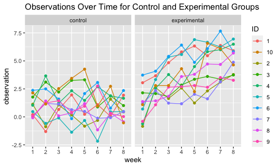

Homework 5
================
Ghislaine Jumonville
2023-11-15

## PROBLEM 1

The code chunk below reads in the Washington Post homicide data, and
creates a new variable `city_state` that combines the city and state
information.

``` r
urlfile = "https://raw.githubusercontent.com/washingtonpost/data-homicides/master/homicide-data.csv"

homicide = read_csv(url(urlfile)) |>
          janitor::clean_names() |>
          mutate(
            city_state = paste(city, state, sep = ", ")
          )
```

There are 52179 observations and 13 variables in the homicide dataset
detailing homicides in 50 states over a 10 year period (January 2007 to
December 2017). Variables include date of homicide (`reported_date`),
name of victim (`victim_last` and `victim_first`), victim demographics
(`victim_race`, `victim_sex`, and `victim_age`), where the crime
occurred (`city`, `state`, `city_state`, `lat`, `long`), as well as the
status of the case - whether the case is open or closed and if there has
been an arrest (`disposition`).

``` r
#number of homicides by city
homicides_city = homicide |>
                  group_by(city_state) |> 
                  summarize(n = n()) |> 
                  knitr::kable(caption = "Number of Homicides by City")
homicides_city
```

| city_state         |    n |
|:-------------------|-----:|
| Albuquerque, NM    |  378 |
| Atlanta, GA        |  973 |
| Baltimore, MD      | 2827 |
| Baton Rouge, LA    |  424 |
| Birmingham, AL     |  800 |
| Boston, MA         |  614 |
| Buffalo, NY        |  521 |
| Charlotte, NC      |  687 |
| Chicago, IL        | 5535 |
| Cincinnati, OH     |  694 |
| Columbus, OH       | 1084 |
| Dallas, TX         | 1567 |
| Denver, CO         |  312 |
| Detroit, MI        | 2519 |
| Durham, NC         |  276 |
| Fort Worth, TX     |  549 |
| Fresno, CA         |  487 |
| Houston, TX        | 2942 |
| Indianapolis, IN   | 1322 |
| Jacksonville, FL   | 1168 |
| Kansas City, MO    | 1190 |
| Las Vegas, NV      | 1381 |
| Long Beach, CA     |  378 |
| Los Angeles, CA    | 2257 |
| Louisville, KY     |  576 |
| Memphis, TN        | 1514 |
| Miami, FL          |  744 |
| Milwaukee, wI      | 1115 |
| Minneapolis, MN    |  366 |
| Nashville, TN      |  767 |
| New Orleans, LA    | 1434 |
| New York, NY       |  627 |
| Oakland, CA        |  947 |
| Oklahoma City, OK  |  672 |
| Omaha, NE          |  409 |
| Philadelphia, PA   | 3037 |
| Phoenix, AZ        |  914 |
| Pittsburgh, PA     |  631 |
| Richmond, VA       |  429 |
| Sacramento, CA     |  376 |
| San Antonio, TX    |  833 |
| San Bernardino, CA |  275 |
| San Diego, CA      |  461 |
| San Francisco, CA  |  663 |
| Savannah, GA       |  246 |
| St. Louis, MO      | 1677 |
| Stockton, CA       |  444 |
| Tampa, FL          |  208 |
| Tulsa, AL          |    1 |
| Tulsa, OK          |  583 |
| Washington, DC     | 1345 |

Number of Homicides by City

``` r
#number of unsolved homicides by city
unsolved_homicides_city = homicide |> 
                            mutate(
                              status = case_match(disposition,
                                c("Closed without arrest","Open/No arrest") ~ "unsolved",
                                .default = "solved")) |> 
                            filter(status == "unsolved") |> 
                            group_by(city_state, status) |> 
                            summarize(n = n()) |> 
                            knitr::kable(caption = "Number of Unsolved Homicides by City")
unsolved_homicides_city
```

| city_state         | status   |    n |
|:-------------------|:---------|-----:|
| Albuquerque, NM    | unsolved |  146 |
| Atlanta, GA        | unsolved |  373 |
| Baltimore, MD      | unsolved | 1825 |
| Baton Rouge, LA    | unsolved |  196 |
| Birmingham, AL     | unsolved |  347 |
| Boston, MA         | unsolved |  310 |
| Buffalo, NY        | unsolved |  319 |
| Charlotte, NC      | unsolved |  206 |
| Chicago, IL        | unsolved | 4073 |
| Cincinnati, OH     | unsolved |  309 |
| Columbus, OH       | unsolved |  575 |
| Dallas, TX         | unsolved |  754 |
| Denver, CO         | unsolved |  169 |
| Detroit, MI        | unsolved | 1482 |
| Durham, NC         | unsolved |  101 |
| Fort Worth, TX     | unsolved |  255 |
| Fresno, CA         | unsolved |  169 |
| Houston, TX        | unsolved | 1493 |
| Indianapolis, IN   | unsolved |  594 |
| Jacksonville, FL   | unsolved |  597 |
| Kansas City, MO    | unsolved |  486 |
| Las Vegas, NV      | unsolved |  572 |
| Long Beach, CA     | unsolved |  156 |
| Los Angeles, CA    | unsolved | 1106 |
| Louisville, KY     | unsolved |  261 |
| Memphis, TN        | unsolved |  483 |
| Miami, FL          | unsolved |  450 |
| Milwaukee, wI      | unsolved |  403 |
| Minneapolis, MN    | unsolved |  187 |
| Nashville, TN      | unsolved |  278 |
| New Orleans, LA    | unsolved |  930 |
| New York, NY       | unsolved |  243 |
| Oakland, CA        | unsolved |  508 |
| Oklahoma City, OK  | unsolved |  326 |
| Omaha, NE          | unsolved |  169 |
| Philadelphia, PA   | unsolved | 1360 |
| Phoenix, AZ        | unsolved |  504 |
| Pittsburgh, PA     | unsolved |  337 |
| Richmond, VA       | unsolved |  113 |
| Sacramento, CA     | unsolved |  139 |
| San Antonio, TX    | unsolved |  357 |
| San Bernardino, CA | unsolved |  170 |
| San Diego, CA      | unsolved |  175 |
| San Francisco, CA  | unsolved |  336 |
| Savannah, GA       | unsolved |  115 |
| St. Louis, MO      | unsolved |  905 |
| Stockton, CA       | unsolved |  266 |
| Tampa, FL          | unsolved |   95 |
| Tulsa, OK          | unsolved |  193 |
| Washington, DC     | unsolved |  589 |

Number of Unsolved Homicides by City

## PROBLEM 2

The code chunk below creates a data frame containing all the names of
the files. Each of the file names include the subject ID and arm
(experimental or control).

``` r
all_file_names = tibble(
                    filename = list.files("./data")
                    ) |> 
                mutate(
                  path = paste("./data/", sep = "", filename)
                ) |> 
                select(path)
```

The code chunk below create a function to read a file and then the
function `load_hw5_files` is iterated over all the files in the folder
to create one large data frame, `all_files`. This data frame contains
the subject ID, what experimental arm they were in, and the observations
for each of the weeks 1 - 8.

``` r
load_hw5_files = function(path, range) {
  df = 
    read_csv(path) |> 
    janitor::clean_names()
  df
}

all_files = all_file_names |> 
              mutate(
                week_observation = map(all_file_names$path, load_hw5_files),
                arm_ID = gsub("./data/","",path),
                arm_ID = gsub(".csv","",arm_ID)) |>
              separate(arm_ID, into = c("arm", "ID")) |> 
              mutate(
                arm = case_match(arm,
                      "con" ~ "control",
                      "exp" ~ "experimental"),
                ID = sub("^0","", ID)) |> 
              unnest(cols = "week_observation") |> 
              select(ID, arm, week_1:week_8)
knitr::kable(all_files)
```

| ID  | arm          | week_1 | week_2 | week_3 | week_4 | week_5 | week_6 | week_7 | week_8 |
|:----|:-------------|-------:|-------:|-------:|-------:|-------:|-------:|-------:|-------:|
| 1   | control      |   0.20 |  -1.31 |   0.66 |   1.96 |   0.23 |   1.09 |   0.05 |   1.94 |
| 2   | control      |   1.13 |  -0.88 |   1.07 |   0.17 |  -0.83 |  -0.31 |   1.58 |   0.44 |
| 3   | control      |   1.77 |   3.11 |   2.22 |   3.26 |   3.31 |   0.89 |   1.88 |   1.01 |
| 4   | control      |   1.04 |   3.66 |   1.22 |   2.33 |   1.47 |   2.70 |   1.87 |   1.66 |
| 5   | control      |   0.47 |  -0.58 |  -0.09 |  -1.37 |  -0.32 |  -2.17 |   0.45 |   0.48 |
| 6   | control      |   2.37 |   2.50 |   1.59 |  -0.16 |   2.08 |   3.07 |   0.78 |   2.35 |
| 7   | control      |   0.03 |   1.21 |   1.13 |   0.64 |   0.49 |  -0.12 |  -0.07 |   0.46 |
| 8   | control      |  -0.08 |   1.42 |   0.09 |   0.36 |   1.18 |  -1.16 |   0.33 |  -0.44 |
| 9   | control      |   0.08 |   1.24 |   1.44 |   0.41 |   0.95 |   2.75 |   0.30 |   0.03 |
| 10  | control      |   2.14 |   1.15 |   2.52 |   3.44 |   4.26 |   0.97 |   2.73 |  -0.53 |
| 1   | experimental |   3.05 |   3.67 |   4.84 |   5.80 |   6.33 |   5.46 |   6.38 |   5.91 |
| 2   | experimental |  -0.84 |   2.63 |   1.64 |   2.58 |   1.24 |   2.32 |   3.11 |   3.78 |
| 3   | experimental |   2.15 |   2.08 |   1.82 |   2.84 |   3.36 |   3.61 |   3.37 |   3.74 |
| 4   | experimental |  -0.62 |   2.54 |   3.78 |   2.73 |   4.49 |   5.82 |   6.00 |   6.49 |
| 5   | experimental |   0.70 |   3.33 |   5.34 |   5.57 |   6.90 |   6.66 |   6.24 |   6.95 |
| 6   | experimental |   3.73 |   4.08 |   5.40 |   6.41 |   4.87 |   6.09 |   7.66 |   5.83 |
| 7   | experimental |   1.18 |   2.35 |   1.23 |   1.17 |   2.02 |   1.61 |   3.13 |   4.88 |
| 8   | experimental |   1.37 |   1.43 |   1.84 |   3.60 |   3.80 |   4.72 |   4.68 |   5.70 |
| 9   | experimental |  -0.40 |   1.08 |   2.66 |   2.70 |   2.80 |   2.64 |   3.51 |   3.27 |
| 10  | experimental |   1.09 |   2.80 |   2.80 |   4.30 |   2.25 |   6.57 |   6.09 |   4.64 |

The code chunk below creates a plot showing the two groups: control and
experimental, and how each subject observation value changes over time.

``` r
all_files_plot = all_files |> 
                    pivot_longer(
                      cols = starts_with("week_"),
                      names_to = "week",
                      values_to = "observation"
                      ) |> 
                    mutate(
                      week = as.numeric(gsub("week_","", week)),
                      week = factor(week)
                      ) |> 
                    ggplot(aes(x = week, y = observation, group = ID, color = ID)) +
                    geom_line() +
                    geom_point() +
                    facet_grid(~arm) +
                    labs(title = "Observations Over Time for Control and Experimental Groups")
                    
all_files_plot
```



Looking at the plots, one can see that the control group have lower
observation values compared to the experimental group. The experimental
group seems to have an upward trend. The control group has fluctuations
throughout the weeks, but end up around the same values that they
started at.
