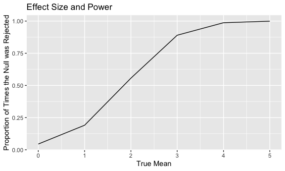
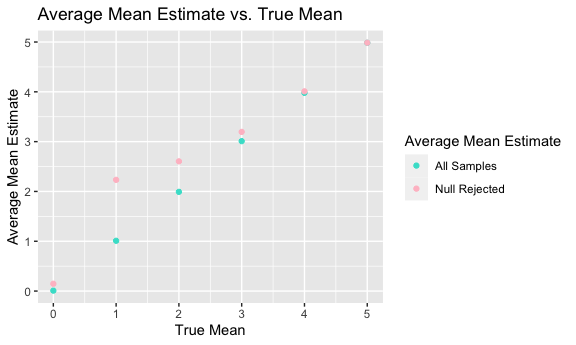

Homework 5
================
Ghislaine Jumonville
2023-11-15

## PROBLEM 1

The code chunk below reads in the Washington Post homicide data, and
creates a new variable `city_state` that combines the city and state
information.

``` r
urlfile = "https://raw.githubusercontent.com/washingtonpost/data-homicides/master/homicide-data.csv"

homicide = read_csv(url(urlfile)) |>
          janitor::clean_names() |>
          mutate(
            city_state = paste(city, state, sep = ", "),
            status = case_match(disposition,
                                c("Closed without arrest","Open/No arrest") ~ "unsolved",
                                .default = "solved")
          )
```

There are 52179 observations and 13 variables in the homicide dataset
detailing homicides in 50 states over a 10 year period (January 2007 to
December 2017). Variables include date of homicide (`reported_date`),
name of victim (`victim_last` and `victim_first`), victim demographics
(`victim_race`, `victim_sex`, and `victim_age`), where the crime
occurred (`city`, `state`, `city_state`, `lat`, `long`), as well as the
status of the case - whether the case is open or closed and if there has
been an arrest (`disposition`).

``` r
#number of homicides by city
homicides_city = homicide |>
                  group_by(city_state) |> 
                  summarize(n = n()) |> 
                  knitr::kable(caption = "Number of Homicides by City")
homicides_city
```

| city_state         |    n |
|:-------------------|-----:|
| Albuquerque, NM    |  378 |
| Atlanta, GA        |  973 |
| Baltimore, MD      | 2827 |
| Baton Rouge, LA    |  424 |
| Birmingham, AL     |  800 |
| Boston, MA         |  614 |
| Buffalo, NY        |  521 |
| Charlotte, NC      |  687 |
| Chicago, IL        | 5535 |
| Cincinnati, OH     |  694 |
| Columbus, OH       | 1084 |
| Dallas, TX         | 1567 |
| Denver, CO         |  312 |
| Detroit, MI        | 2519 |
| Durham, NC         |  276 |
| Fort Worth, TX     |  549 |
| Fresno, CA         |  487 |
| Houston, TX        | 2942 |
| Indianapolis, IN   | 1322 |
| Jacksonville, FL   | 1168 |
| Kansas City, MO    | 1190 |
| Las Vegas, NV      | 1381 |
| Long Beach, CA     |  378 |
| Los Angeles, CA    | 2257 |
| Louisville, KY     |  576 |
| Memphis, TN        | 1514 |
| Miami, FL          |  744 |
| Milwaukee, wI      | 1115 |
| Minneapolis, MN    |  366 |
| Nashville, TN      |  767 |
| New Orleans, LA    | 1434 |
| New York, NY       |  627 |
| Oakland, CA        |  947 |
| Oklahoma City, OK  |  672 |
| Omaha, NE          |  409 |
| Philadelphia, PA   | 3037 |
| Phoenix, AZ        |  914 |
| Pittsburgh, PA     |  631 |
| Richmond, VA       |  429 |
| Sacramento, CA     |  376 |
| San Antonio, TX    |  833 |
| San Bernardino, CA |  275 |
| San Diego, CA      |  461 |
| San Francisco, CA  |  663 |
| Savannah, GA       |  246 |
| St. Louis, MO      | 1677 |
| Stockton, CA       |  444 |
| Tampa, FL          |  208 |
| Tulsa, AL          |    1 |
| Tulsa, OK          |  583 |
| Washington, DC     | 1345 |

Number of Homicides by City

``` r
#number of unsolved homicides by city
unsolved_homicides_city = homicide |> 
                            filter(status == "unsolved") |> 
                            group_by(city_state) |> 
                            summarize(n = n()) |> 
                            knitr::kable(caption = "Number of Unsolved Homicides by City")
unsolved_homicides_city
```

| city_state         |    n |
|:-------------------|-----:|
| Albuquerque, NM    |  146 |
| Atlanta, GA        |  373 |
| Baltimore, MD      | 1825 |
| Baton Rouge, LA    |  196 |
| Birmingham, AL     |  347 |
| Boston, MA         |  310 |
| Buffalo, NY        |  319 |
| Charlotte, NC      |  206 |
| Chicago, IL        | 4073 |
| Cincinnati, OH     |  309 |
| Columbus, OH       |  575 |
| Dallas, TX         |  754 |
| Denver, CO         |  169 |
| Detroit, MI        | 1482 |
| Durham, NC         |  101 |
| Fort Worth, TX     |  255 |
| Fresno, CA         |  169 |
| Houston, TX        | 1493 |
| Indianapolis, IN   |  594 |
| Jacksonville, FL   |  597 |
| Kansas City, MO    |  486 |
| Las Vegas, NV      |  572 |
| Long Beach, CA     |  156 |
| Los Angeles, CA    | 1106 |
| Louisville, KY     |  261 |
| Memphis, TN        |  483 |
| Miami, FL          |  450 |
| Milwaukee, wI      |  403 |
| Minneapolis, MN    |  187 |
| Nashville, TN      |  278 |
| New Orleans, LA    |  930 |
| New York, NY       |  243 |
| Oakland, CA        |  508 |
| Oklahoma City, OK  |  326 |
| Omaha, NE          |  169 |
| Philadelphia, PA   | 1360 |
| Phoenix, AZ        |  504 |
| Pittsburgh, PA     |  337 |
| Richmond, VA       |  113 |
| Sacramento, CA     |  139 |
| San Antonio, TX    |  357 |
| San Bernardino, CA |  170 |
| San Diego, CA      |  175 |
| San Francisco, CA  |  336 |
| Savannah, GA       |  115 |
| St. Louis, MO      |  905 |
| Stockton, CA       |  266 |
| Tampa, FL          |   95 |
| Tulsa, OK          |  193 |
| Washington, DC     |  589 |

Number of Unsolved Homicides by City

## PROBLEM 2

The code chunk below creates a data frame containing all the names of
the files. Each of the file names include the subject ID and arm
(experimental or control).

``` r
all_file_names = tibble(
                    filename = list.files("./data")
                    ) |> 
                mutate(
                  path = paste("./data/", sep = "", filename)
                ) |> 
                select(path)
```

The code chunk below create a function to read a file and then the
function `load_hw5_files` is iterated over all the files in the folder
to create one large data frame, `all_files`. This data frame contains
the subject ID, what experimental arm they were in, and the observations
for each of the weeks 1 - 8.

``` r
load_hw5_files = function(path, range) {
  df = 
    read_csv(path) |> 
    janitor::clean_names()
  df
}

all_files = all_file_names |> 
              mutate(
                week_observation = map(all_file_names$path, load_hw5_files),
                arm_ID = gsub("./data/","",path),
                arm_ID = gsub(".csv","",arm_ID)) |>
              separate(arm_ID, into = c("arm", "ID")) |> 
              mutate(
                arm = case_match(arm,
                      "con" ~ "control",
                      "exp" ~ "experimental"),
                ID = sub("^0","", ID)) |> 
              unnest(cols = "week_observation") |> 
              select(ID, arm, week_1:week_8)
knitr::kable(all_files)
```

| ID  | arm          | week_1 | week_2 | week_3 | week_4 | week_5 | week_6 | week_7 | week_8 |
|:----|:-------------|-------:|-------:|-------:|-------:|-------:|-------:|-------:|-------:|
| 1   | control      |   0.20 |  -1.31 |   0.66 |   1.96 |   0.23 |   1.09 |   0.05 |   1.94 |
| 2   | control      |   1.13 |  -0.88 |   1.07 |   0.17 |  -0.83 |  -0.31 |   1.58 |   0.44 |
| 3   | control      |   1.77 |   3.11 |   2.22 |   3.26 |   3.31 |   0.89 |   1.88 |   1.01 |
| 4   | control      |   1.04 |   3.66 |   1.22 |   2.33 |   1.47 |   2.70 |   1.87 |   1.66 |
| 5   | control      |   0.47 |  -0.58 |  -0.09 |  -1.37 |  -0.32 |  -2.17 |   0.45 |   0.48 |
| 6   | control      |   2.37 |   2.50 |   1.59 |  -0.16 |   2.08 |   3.07 |   0.78 |   2.35 |
| 7   | control      |   0.03 |   1.21 |   1.13 |   0.64 |   0.49 |  -0.12 |  -0.07 |   0.46 |
| 8   | control      |  -0.08 |   1.42 |   0.09 |   0.36 |   1.18 |  -1.16 |   0.33 |  -0.44 |
| 9   | control      |   0.08 |   1.24 |   1.44 |   0.41 |   0.95 |   2.75 |   0.30 |   0.03 |
| 10  | control      |   2.14 |   1.15 |   2.52 |   3.44 |   4.26 |   0.97 |   2.73 |  -0.53 |
| 1   | experimental |   3.05 |   3.67 |   4.84 |   5.80 |   6.33 |   5.46 |   6.38 |   5.91 |
| 2   | experimental |  -0.84 |   2.63 |   1.64 |   2.58 |   1.24 |   2.32 |   3.11 |   3.78 |
| 3   | experimental |   2.15 |   2.08 |   1.82 |   2.84 |   3.36 |   3.61 |   3.37 |   3.74 |
| 4   | experimental |  -0.62 |   2.54 |   3.78 |   2.73 |   4.49 |   5.82 |   6.00 |   6.49 |
| 5   | experimental |   0.70 |   3.33 |   5.34 |   5.57 |   6.90 |   6.66 |   6.24 |   6.95 |
| 6   | experimental |   3.73 |   4.08 |   5.40 |   6.41 |   4.87 |   6.09 |   7.66 |   5.83 |
| 7   | experimental |   1.18 |   2.35 |   1.23 |   1.17 |   2.02 |   1.61 |   3.13 |   4.88 |
| 8   | experimental |   1.37 |   1.43 |   1.84 |   3.60 |   3.80 |   4.72 |   4.68 |   5.70 |
| 9   | experimental |  -0.40 |   1.08 |   2.66 |   2.70 |   2.80 |   2.64 |   3.51 |   3.27 |
| 10  | experimental |   1.09 |   2.80 |   2.80 |   4.30 |   2.25 |   6.57 |   6.09 |   4.64 |

The code chunk below creates a plot showing the two groups: control and
experimental, and how each subject observation value changes over time.

``` r
all_files_plot = all_files |> 
                    pivot_longer(
                      cols = starts_with("week_"),
                      names_to = "week",
                      values_to = "observation"
                      ) |> 
                    mutate(
                      week = as.numeric(gsub("week_","", week)),
                      week = factor(week)
                      ) |> 
                    ggplot(aes(x = week, y = observation, group = ID, color = ID)) +
                    geom_line() +
                    geom_point() +
                    facet_grid(~arm) +
                    labs(title = "Observations Over Time for Control and Experimental Groups")
                    
all_files_plot
```


Looking at the plots, one can see that the control group have lower
observation values compared to the experimental group. The experimental
group seems to have an upward trend. The control group has fluctuations
throughout the weeks, but end up around the same values that they
started at.

## PROBLEM 3

The code chunk below creates a function that will generate samples from
a normal distribution in which only the true mean of the distribution
will change with the input while the sample size (n = 30) and standard
deviation will remain the same (sigma = 5).

``` r
sim_t_test = function(mu) {
  sim_data = 
    tibble(
        x = rnorm(30, mean = mu, sd = 5))
  
  t.test(sim_data$x, alternative = "two.sided", conf.level = 0.95) |>
    broom::tidy() |>
    select(estimate, p.value)
}
```

The code chunk below creates a data frame containing 30,000
observations.There are 5,000 samples that were generated using the
function with their respective t-test results (mean estimate and
p-value). This was done for values of mu 0:5, which has resulted in
30,000 observations in this final dataset.

``` r
mu_results_df = 
  expand_grid(
    mu = c(0, 1, 2, 3, 4, 5),
    iter = 1:5000) |> 
  mutate(
    output = map(mu, sim_t_test)
  ) |> 
  unnest(output)

head(mu_results_df)
```

    ## # A tibble: 6 × 4
    ##      mu  iter estimate p.value
    ##   <dbl> <int>    <dbl>   <dbl>
    ## 1     0     1   -0.236   0.794
    ## 2     0     2    0.892   0.252
    ## 3     0     3    0.122   0.879
    ## 4     0     4   -0.469   0.575
    ## 5     0     5   -0.918   0.388
    ## 6     0     6    0.769   0.379

The code chunk below creates a plot that compares the proportion of time
we rejected the null hypothesis, meaning that our p-value was greater
than 0.05 and the true mean. Looking at the plot below we can see that
as effect size increases (true mean) the proportion of time we reject
the null hypothesis also increases. This is because that as the effect
size increases our power (the likelihood we reject the null hypothesis
given that the alternative is true) also increases.

``` r
null_reject_plot = 
  mu_results_df |> 
  filter(p.value < 0.05) |> 
  group_by(mu) |> 
  summarize(
    total_n = n()) |> 
  mutate(
    prop_reject_null = total_n/5000
  ) |> 
  ggplot(aes(x = mu, y = prop_reject_null)) + 
    geom_line() + 
    labs(
      title = "Effect Size and Power",
      x = "True Mean",
      y = "Proportion of Times the Null was Rejected")

null_reject_plot
```



The code chunk below creates a plot that is looking at the average mean
estimates for all the samples and then for only the samples in which the
null was rejected for each value of the true mean. The sample average
mean estimate across tests for which the null was rejected is further
away from the true mean than the sample average mean estimate across all
tests. However, as the true mean increases the value of the average mean
estimate when the null is rejected gets closer to the actual value. This
is because as the effect size gets larger the average mean estimates
will get closer to the true mean.

``` r
avg_mu_hat_plot = 
  mu_results_df |> 
  group_by(mu) |> 
  summarize(
    avg_mu_hat = mean(estimate),
    avg_mu_hat_rejected = mean(estimate[p.value < 0.05])
  ) |> 
  pivot_longer(
    cols = starts_with("avg"),
    names_to = "mu_hat",
    values_to = "avg_mean_estimate"
  ) |> 
  ggplot(aes(x = mu, y = avg_mean_estimate, color = mu_hat)) + 
  geom_point() +
  labs(
    title = "Average Mean Estimate vs. True Mean",
    x = "True Mean",
    y = "Average Mean Estimate"
  ) +
  scale_color_manual(
    values = c("turquoise", "pink"),
    labels = c("All Samples", "Null Rejected"),
    name = "Average Mean Estimate"
  )

avg_mu_hat_plot
```


